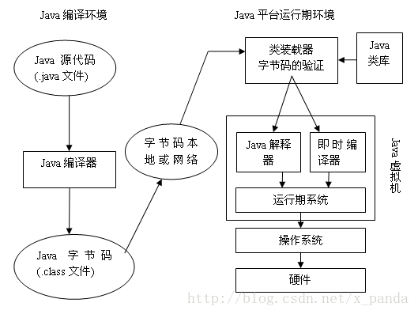

# Java程序设计绪论
## Java运行机制



1.在IDE中编写java源文件（文本文件）

2.编译java源文件，生成.class文件（字节码）
```shell
javac filename.java
```
javac 是java源文件编译器

3..class文件可以在不同的适用于不同的操作系统的JVM上运行，以达到portable的目的

4..class实际上是一系列指令集，JVM的主要功能是进行interpret，逐步解释.class文件中的指令

总的来说java的运行过程分为两部分：第一步编译，第二部解释（执行）

## 细节解释

### 编译过程
编译过程没什么好说的，值得注意的是，从 .class 后缀名可以猜测，字节码是用来记录java类的定义的，而每个Java的类都将生成一个 .class 文件，而 .class 文件才是真正“有用”的文件

### 解释过程
解释过程在JVM中进行
```shell
java Class1
```
java是JVM的启动器，它将.class文件加载到JVM中，然后JVM解释.class文件，并运行程序。刚刚我们提到，每一个类都有一个字节码文件，这里的语句将执行Class1类的main方法。所以这里的机制也可以理解为将Class1“载入”JVM中。但是问题在于，Class1的main方法可能使用到了其他的类，所以，JVM需要将这些类也“载入”到JVM中，才能执行。而JVM处理的方法是在遇到引用其他类的时候，会自动将这些类也“载入”到JVM中，这是一个“添加”的过程

